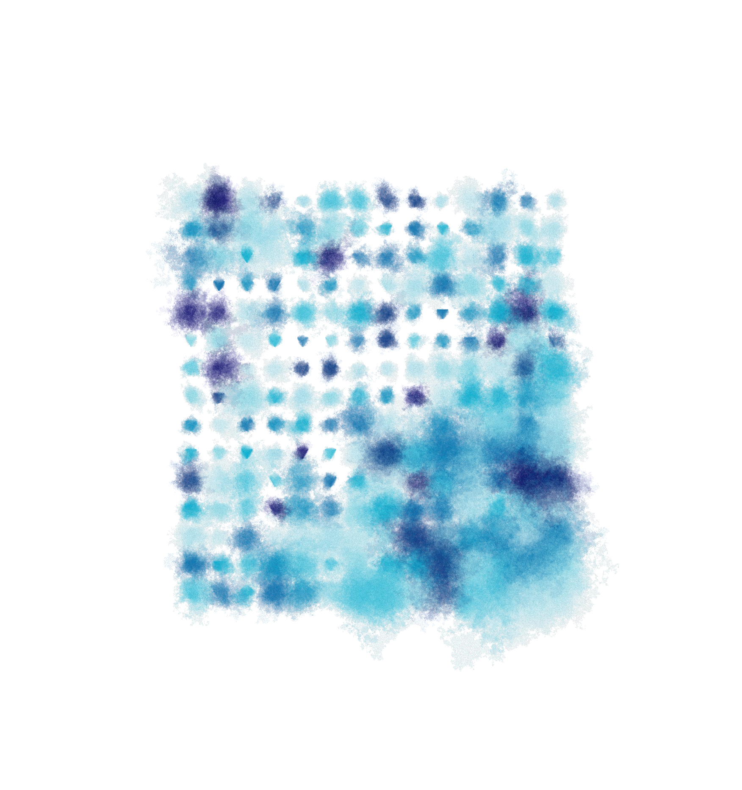

A program to draw a watercolor effect based on [Tyler Hobbs'
method](https://tylerxhobbs.com/essays/2017/a-generative-approach-to-simulating-watercolor-paints). Code
and demo [here](https://editor.p5js.org/0xekez/sketches/sqfNAIfnu).

